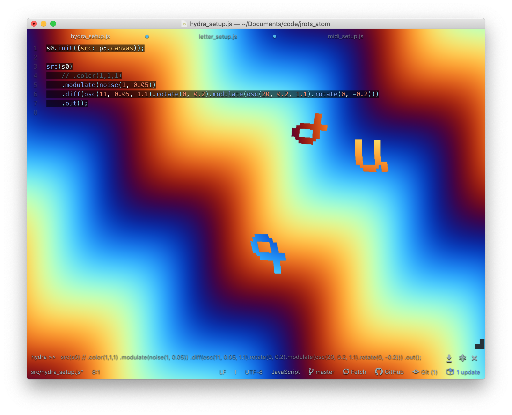

# jrots_atom

## Run

1. Start [atom](https://atom.io/)
 - install [atom-hydra](https://atom.io/packages/atom-hydra)
2. Toggle hydra
 - packages > atom-hydra > toggle
3. Open, select all and shift-enter these files in order:
 - `midi_setup.js`
 - `letter_setup.js`
 - `hydra_setup.js`
