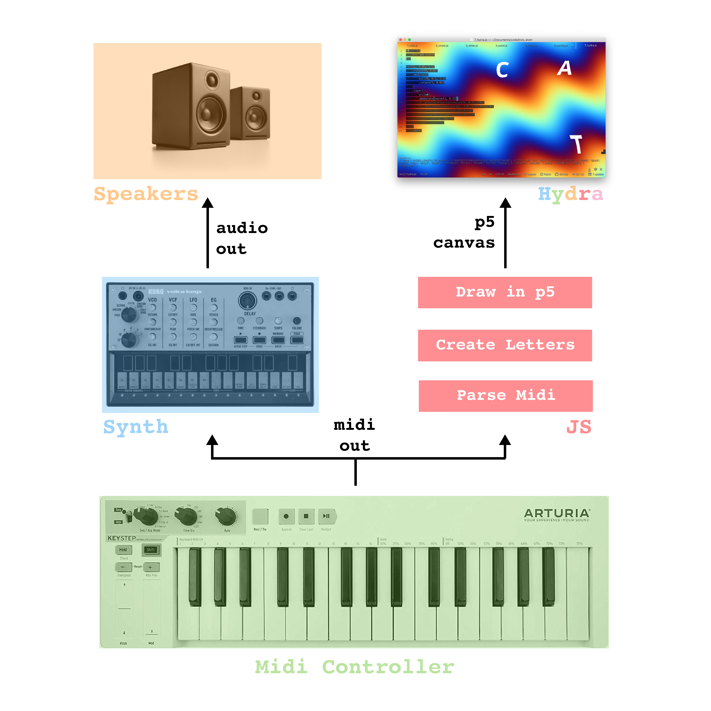

# jrots

A livecode environment in atom based on [hydra](https://github.com/ojack/hydra) and [p5](https://p5js.org/) that produces visuals with letters and words from midi input.

## Run

1. Connect midi device
2. Start [atom](https://atom.io/)
 - install [atom-hydra](https://atom.io/packages/atom-hydra)
3. Toggle hydra
 - packages > atom-hydra > toggle
4. Open files in `src/` in order, select all code and press `shift-enter` to execute.
5. Livecode and play midi
 - edit hydra in `*_hydra.js`
 - edit constants in `*_config.js`.
 - play midi notes

## Todo

- [ ] Produce mock midi input via keyboard
  - [ ] Sample sound for midi input
- [ ] Record a demo video.
- [ ] When one note/letter is removed from a displayed word, consider *not* changing the remainder into a new word.
  - This will probably require keeping track of the list of words displayed and having rules around when a complete/partial word can be replaced by a new one.
- [ ] Register words with specific combinations of notes.
  - For example if c-maj will always show "FOX" according to either a predifined config or the random word it was assigned the first time it played.

## Resources

- https://github.com/ojack/hydra
- https://atom.io/packages/atom-hydra
- https://github.com/ojack/hydra-examples
- https://p5js.org/reference/
